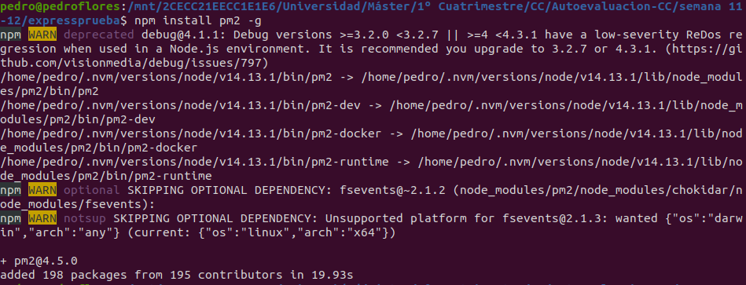
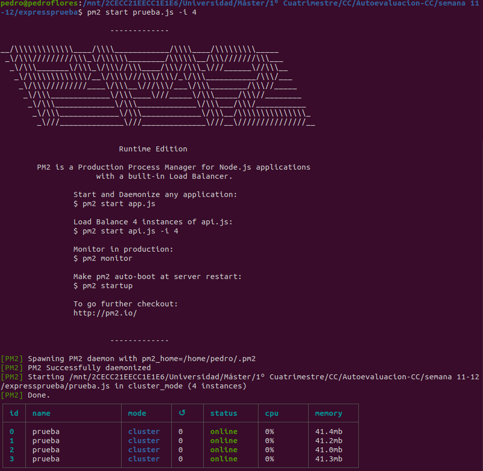
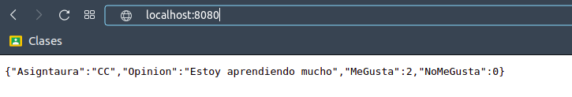
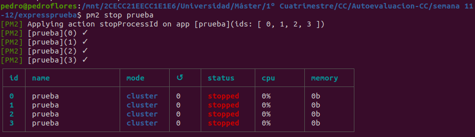
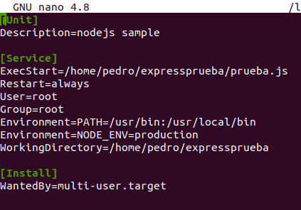
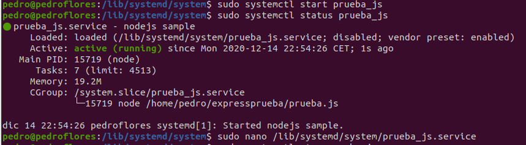

# 5. Experimentar con diferentes gestores de procesos y servidores web front-end para un microservicio que se haya hecho con antelación, por ejemplo en la sección anterior.

Primero vamos a probar `pm2`. Lo instalamos mediante la siguiente orden.

Ahora lo ejecutamos con el programa que hemos construido en los ejercicios anteriores (podemos encontrarlo [aquí](../semana%2011-12/expressprueba/prueba.js)) como viene en el ejemplo

Vemos que efectivamente funciona

Y ahora lo paramos 

Ahora vamos a probar con `systemd`. Para ello, primero creamos el fichero del servicio según las referencias (se ha cambiado la ubicación del proyecto al `home` y se modificado el archivo de ejecución incluendo `#!/usr/bin/env node` al principio del mismo).

Ahora lo arrancamos y vemos su estado

Si accedemos a la dirección del mismo veríamos que funciona como en el caso anterior.

Referencias:
* [How do I run a Node.js app as a systemd service?
](https://stackoverflow.com/questions/54648839/how-do-i-run-a-node-js-app-as-a-systemd-service)
* [ALL POSTS HOW TO
Running Your Node.js App With Systemd - Part 1](https://nodesource.com/blog/running-your-node-js-app-with-systemd-part-1)