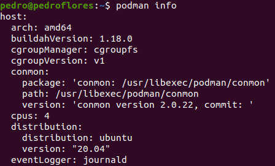
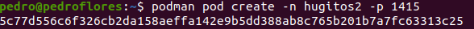
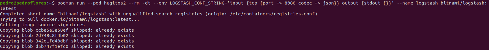

# 1. Crear un pod con dos o más contenedores, de forma que se pueda usar uno desde el otro. Uno de los contenedores contendrá la aplicación que queramos desplegar.

Primero, vemos que efectivamente tenemos `podman` instalado:

Ahora, seguimos los mismos pasos que en los apuntes

