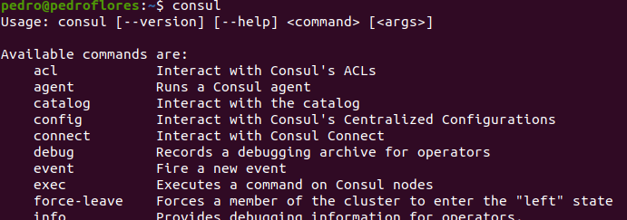
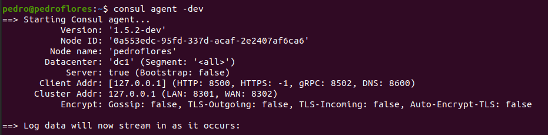
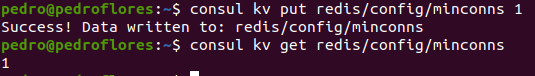

# 2. Instalar consul, averiguar qué bibliotecas funcionan bien con el lenguaje que estemos escribiendo el proyecto (u otro lenguaje), y hacer un pequeño ejemplo de almacenamiento y recuperación de una clave desde la línea de órdenes.

 Para la instalación de `consul` se ha seguido [este tutorial](https://learn.hashicorp.com/tutorials/consul/get-started-install?in=consul/getting-started) para instalarlo. Vemos que se ha instalado correctamente

 

 Las bibliotecas que funcionan correctamente con el lenguaje que estamos usando las encontramos es `"github.com/hashicorp/consul/api"` y [aquí](https://godoc.org/github.com/hashicorp/consul/api) tenemos la documentación de la misma. Si queremos hacer el ejemplo desde la línea de órdenes, usamos la misma página del manual de instalación donde viene una guía bastante completa. Primero lo iniciamos y luego hacemos el proceso de registrar y obtener.

