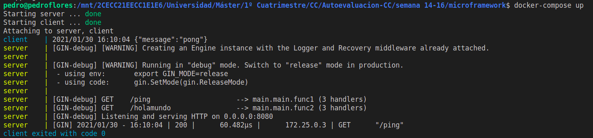

# 2. Usar un miniframework REST para crear un servicio web e introducirlo en un contenedor, y componerlo con un cliente REST que sea el que finalmente se ejecuta y sirve como “frontend”.

Un ejemplo se puede ver en el [proyecto de la asignatura](https://github.com/PedroMFC/EvaluaUGR) donde se ha llevadoa cabo un proceso similar. Un ejemplo más sencillo lo podemos ver en el siguiente ejemplo. El código lo encontramos en la carpeta [microframework](./microframework) y es el mismo que usamos anteriormente para otro ejercicio. Ahora vamos a extenderlo mediante `docker-compose`. Lo que tenemos es simplemente un contenedor con un servicio web y mediante otro contenedor le hacemos una petición al mismo. Vemos cómo se ha llevado a cabo la petición `GET` adecuadamente

