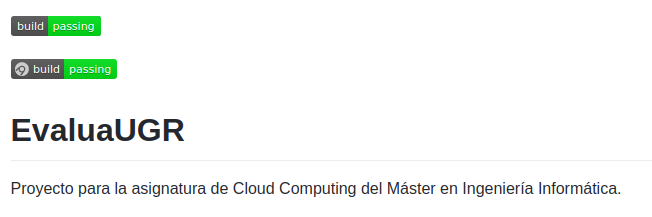

# 2 Configurar integración continua para nuestra aplicación usando Travis o algún otro sitio.

Se puede ver en la página del proyecto [EvaluaUGR](https://github.com/PedroMFC/EvaluaUGR). Se ha usado Travis y AppVeyor para CI.

* [.travis.yml](https://github.com/PedroMFC/EvaluaUGR/blob/main/.travis.yml)
* [appveyor.yml](https://github.com/PedroMFC/EvaluaUGR/blob/main/appveyor.yml)

En la siguiente imagen vemos cómo dicho repositorio tiene los *badges* de los dos sistemas pasando.

