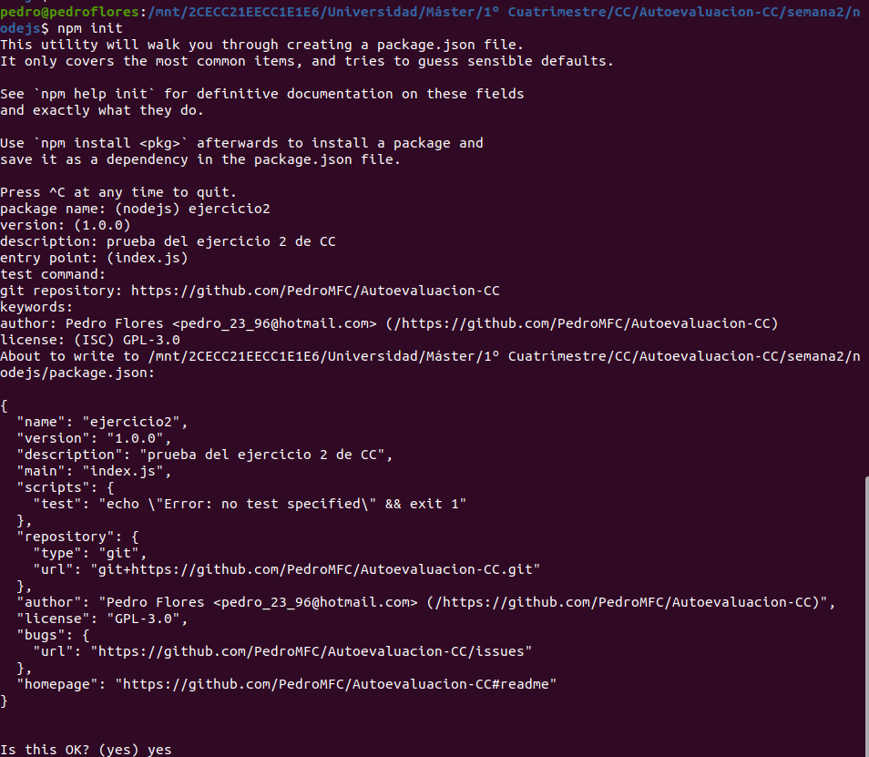
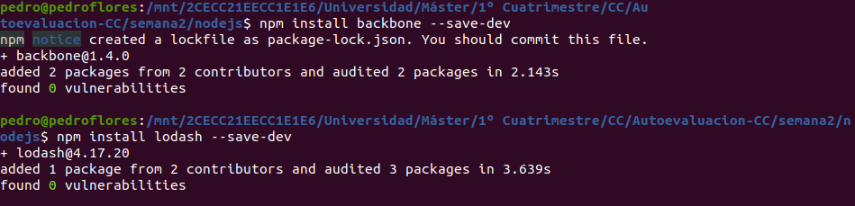

# 2. Crear una descripción del módulo usando package.json. En caso de que se trate de otro lenguaje, usar el método correspondiente.

Para crear la descripción de un módulo usando `package.json` se ha seguido [esta guía](https://medium.com/noders/t%C3%BA-yo-y-package-json-9553929fb2e3).

1. Usamos `npm` para crear el archivo directamente.
   
2. El archivo que crea por defecto es:
   ```json
   {
   "name": "ejercicio2",
   "version": "1.0.0",
   "description": "prueba del ejercicio 2 de CC",
   "main": "index.js",
   "scripts": {
      "test": "echo \"Error: no test specified\" && exit 1"
   },
   "repository": {
      "type": "git",
      "url": "git+https://github.com/PedroMFC/Autoevaluacion-CC.git"
   },
   "author": "Pedro Flores <pedro_23_96@hotmail.com> (/https://github.com/PedroMFC/Autoevaluacion-CC)",
   "license": "GPL-3.0",
   "bugs": {
      "url": "https://github.com/PedroMFC/Autoevaluacion-CC/issues"
   },
   "homepage": "https://github.com/PedroMFC/Autoevaluacion-CC#readme"
   }
   ```
3. Podemos incluir algunos campos más a modo de ejemplo como indica la guía mencionada. Para ello, usamos `--save-dev` para que guarde directamente la configuración.
4. 
 
   ```json
   {
      "name": "ejercicio2",
      "version": "1.0.0",
      "description": "prueba del ejercicio 2 de CC",
      "main": "index.js",
      "scripts": {
         "test": "echo \"Error: no test specified\" && exit 1"
      },
      "repository": {
         "type": "git",
         "url": "git+https://github.com/PedroMFC/Autoevaluacion-CC.git"
      },
      "author": "Pedro Flores <pedro_23_96@hotmail.com> (/https://github.com/PedroMFC/Autoevaluacion-CC)",
      "license": "GPL-3.0",
      "bugs": {
         "url": "https://github.com/PedroMFC/Autoevaluacion-CC/issues"
      },
      "homepage": "https://github.com/PedroMFC/Autoevaluacion-CC#readme",
      "engines": {
         "node": "≥ 6.0.0",
         "npm": "≥ 3.0.0"
      },
      "devDependencies": {
         "backbone": "^1.4.0",
         "lodash": "^4.17.20"
      }
   }
   ```