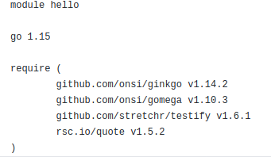

# 2. Crear una descripción del módulo usando package.json. En caso de que se trate de otro lenguaje, usar el método correspondiente.

Para crear la descripción de un módulo usando `package.json` se ha seguido [esta guía](https://medium.com/noders/t%C3%BA-yo-y-package-json-9553929fb2e3).

1. Usamos `npm` para crear el archivo directamente.
   
2. El archivo que crea por defecto es:
   ```json
   {
   "name": "ejercicio2",
   "version": "1.0.0",
   "description": "prueba del ejercicio 2 de CC",
   "main": "index.js",
   "scripts": {
      "test": "echo \"Error: no test specified\" && exit 1"
   },
   "repository": {
      "type": "git",
      "url": "git+https://github.com/PedroMFC/Autoevaluacion-CC.git"
   },
   "author": "Pedro Flores <pedro_23_96@hotmail.com> (/https://github.com/PedroMFC/Autoevaluacion-CC)",
   "license": "GPL-3.0",
   "bugs": {
      "url": "https://github.com/PedroMFC/Autoevaluacion-CC/issues"
   },
   "homepage": "https://github.com/PedroMFC/Autoevaluacion-CC#readme"
   }
   ```
3. Podemos incluir algunos campos más a modo de ejemplo como indica la guía mencionada. Para ello, usamos `--save-dev` para que guarde directamente la configuración.
4. 
 
   ```json
   {
      "name": "ejercicio2",
      "version": "1.0.0",
      "description": "prueba del ejercicio 2 de CC",
      "main": "index.js",
      "scripts": {
         "test": "echo \"Error: no test specified\" && exit 1"
      },
      "repository": {
         "type": "git",
         "url": "git+https://github.com/PedroMFC/Autoevaluacion-CC.git"
      },
      "author": "Pedro Flores <pedro_23_96@hotmail.com> (/https://github.com/PedroMFC/Autoevaluacion-CC)",
      "license": "GPL-3.0",
      "bugs": {
         "url": "https://github.com/PedroMFC/Autoevaluacion-CC/issues"
      },
      "homepage": "https://github.com/PedroMFC/Autoevaluacion-CC#readme",
      "engines": {
         "node": "≥ 6.0.0",
         "npm": "≥ 3.0.0"
      },
      "devDependencies": {
         "backbone": "^1.4.0",
         "lodash": "^4.17.20"
      }
   }
   ```

 Para el proyecto de la asignatura, se ha decidio utilizar el lenguaje de programación `Go`. Como es un lenguaje con el que no he trabajado hasta ahora, se ha creado un proyecto que podríamos notar como auxiliar para "experimentar" en él la forma de trabajo del lenguaje y luego poder aplicarlo al proyecto principal. Toda la información está en el repositorio [prueba](https://github.com/PedroMFC/prueba). En Go, para trabajar con las dependencias se va a usar la herramientas [Go Modules](https://blog.golang.org/using-go-modules). De este modo, las dependencias del proyecto se guardan en el archivo `go.mod` que se puede consultar [aquí](https://github.com/PedroMFC/prueba/blob/main/go.mod) y que es de la siguiente forma (se ha incorporado una dependencia `rsc.io/quote` y a algunas herramientas de tests).

 

 ### NOTA: cuando se avance con el proyecto se incluirá la información en el ejercicio.