# 3. Descargar el repositorio de ejemplo anterior, instalar las herramientas necesarias (principalmente Scala y sbt) y ejecutar el ejemplo desde `sbt`. Alternativamente, buscar otros marcos para REST en Scala tales como Finatra o Scalatra y probar los ejemplos que se incluyan en el repositorio.

1. Descargamos el [repositorio](https://github.com/JJ/spray-test) tal y como se indica en su documentación
   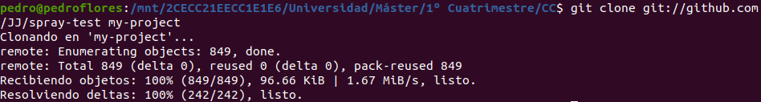
2. Instalamos Scala y `sbt` siguiendo [este manual](https://howtoinstall.co/es/ubuntu/xenial/scala) y [este](https://www.scala-lang.org/download/) (ya tenemos java 8 instalado).
   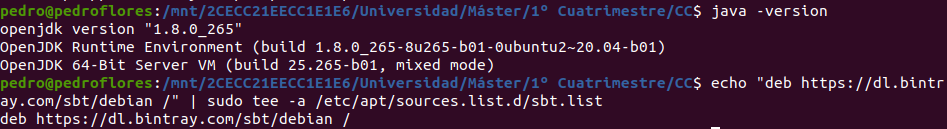
   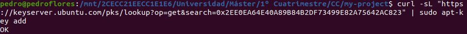
   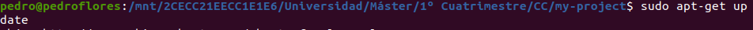
   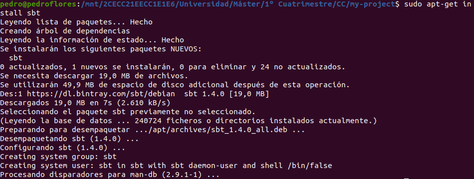
   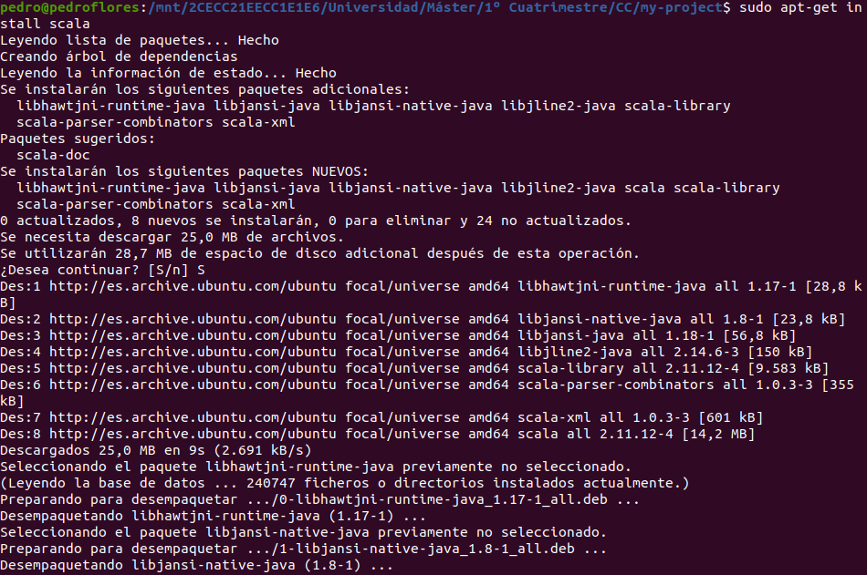
3. Ejecutamos `sbt`.
   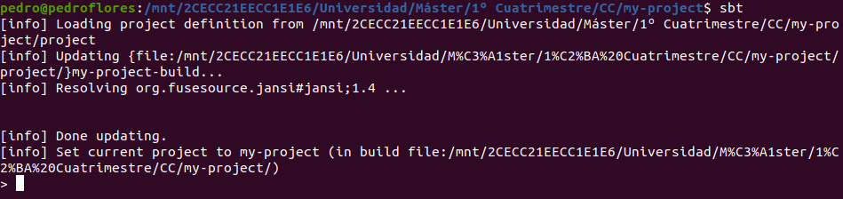
4.  Ejecutamos `re-start`.
   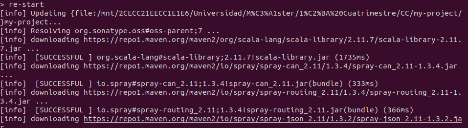
   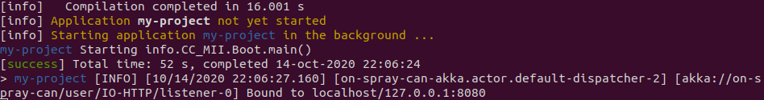

5.  Hacemos algunas pruebas.
   
   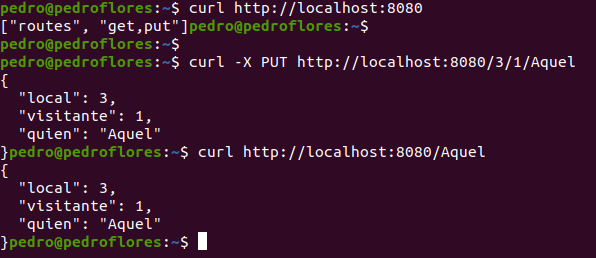

6.  Finalizamos con `re-stop`
   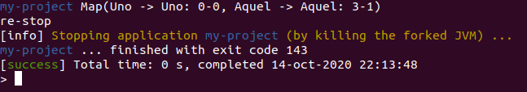