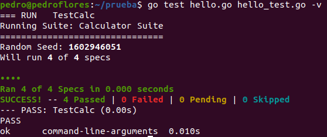

# 4. Para la aplicación que se está haciendo, escribir una serie de aserciones y probar que efectivamente no fallan. Añadir tests para una nueva funcionalidad, probar que falla y escribir el código para que no lo haga. A continuación, ejecutarlos desde mocha (u otro módulo de test de alto nivel), usando descripciones del test y del grupo de test de forma correcta. Si hasta ahora no has subido el código que has venido realizando a GitHub, es el momento de hacerlo, porque lo vamos a necesitar un poco más adelante.

Como se ha indicado en el [ejercicio2](https://github.com/PedroMFC/Autoevaluacion-CC/blob/main/semana%202/Ejercicio2.md), se va a comenzar explicando el trabajo con un [proyecto de pruebas](https://github.com/PedroMFC/prueba) que se completará cuando se haga en el proyecto principal. La información se ha obtenido de [este enlace](https://blog.golang.org/using-go-modules) con un uso básico de la librería estandar de GO y [este otro](https://bmuschko.com/blog/go-testing-frameworks/) donde explica algunos *frameworks* para los tests, donde destacamos [Testify](https://github.com/stretchr/testify) que sirve para las aserciones y *mocking* y [Ginkgo](https://github.com/onsi/ginkgo) que presenta el sistema *Behaviour Driven Development* que permiten describir los tests. Los tests se han divido en dos archivos donde los dos primeros mecanismos se han probado en [hello2_test.go](https://github.com/PedroMFC/prueba/blob/main/hello2_test.go) y `Ginkgo` en [hello_test.go](https://github.com/PedroMFC/prueba/blob/main/hello_test.go).

Ejecutamos los test y se obtiene lo siguiente:

### NOTA: cuando se avance con el proyecto se incluirá la información en el ejercicio.