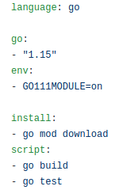
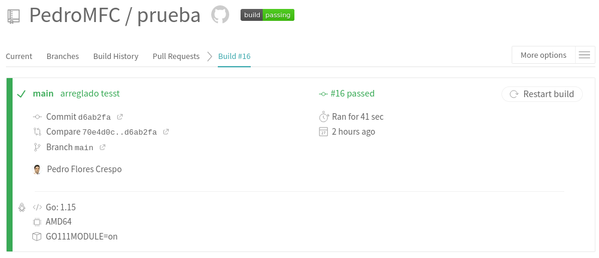

# 5. Rrealizar las siguientes tareas en el proyecto que se está trabajando:
## a)  Darse de alta en Travis.
## b) Activar el repositorio en el que se vaya a aplicar la integración continua.
## c) Crear un fichero de configuración para que se ejecute la integración y añadirlo al repositorio.

Como se ha indicado en el [ejercicio2](https://github.com/PedroMFC/Autoevaluacion-CC/blob/main/semana%202/Ejercicio2.md), se va a comenzar explicando el trabajo con un [proyecto de pruebas](https://github.com/PedroMFC/prueba) que se completará cuando se haga en el proyecto principal. Como bien indica el ejercicio, nos hemos dado de alta en `travis` (ya estábamos dados de alta) y se ha incluido el repositorio desde la configuración. Ahora, se ha incluido el archivo [`.travis.yml`](https://github.com/PedroMFC/prueba/blob/main/.travis.yml) en el repositorio para ejecutar la integración continua. El archivo es de la siguiente forma.

 
Vemos que en travis a pasado los tests

Los enlaces consultados para la configuración han sido:
* [Documentación de Travis](https://docs.travis-ci.com/user/tutorial/).
* [Build a Go Project](https://docs.travis-ci.com/user/languages/go/).
* [Using Go modules with Travis CI](https://dave.cheney.net/2018/07/16/using-go-modules-with-travis-ci)

Para el proyecto principal [EvaluaUGR](https://github.com/PedroMFC/EvaluaUGR), el archivo de CI se encuentra [aquí](https://github.com/PedroMFC/EvaluaUGR/blob/main/.travis.yml).