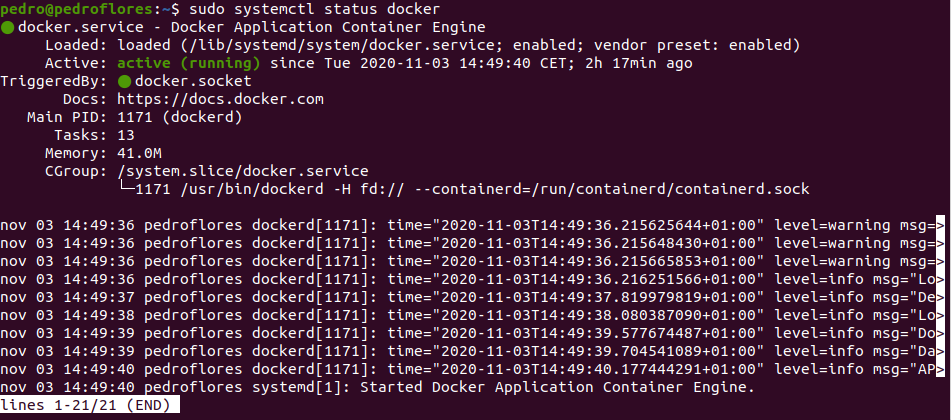
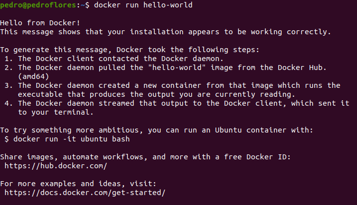
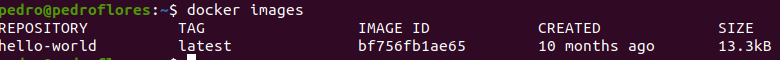
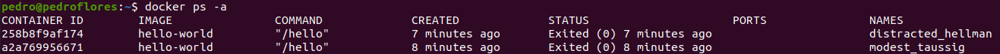
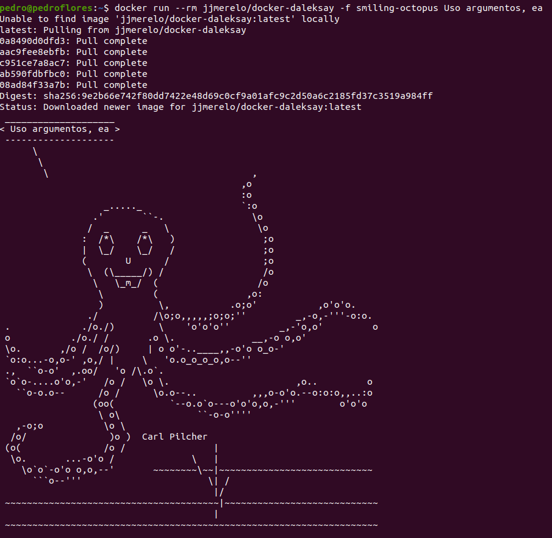

## 1. Buscar alguna demo interesante de Docker y ejecutarla localmente, o en su defecto, ejecutar la imagen anterior y ver cómo funciona y los procesos que se llevan a cabo la primera vez que se ejecuta y las siguientes ocasiones.

En primer lugar, se ha seguido [este tutorial](https://docs.docker.com/engine/install/ubuntu/) para poder instalar *docker* en Ubuntu. También se ha consultado [esta página](https://www.digitalocean.com/community/tutorials/how-to-install-and-use-docker-on-ubuntu-20-04-es)  para algunas nociones básicas del uso de la herramienta.

Vemos que tenemos el servicio activo:


 
Ejecutamos 

```
docker run hello-world
```
y obtenemos



Veamos las imágenes que tenemos



Listamos los contenedores



Ejecutamos el siguiente ejemplo:




A diferencia de `hello-world` que ya teníamos la images, en este caso vemos cómo se la tiene que descargar para poder ejecutarlo.