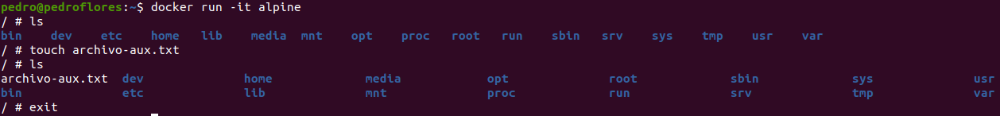
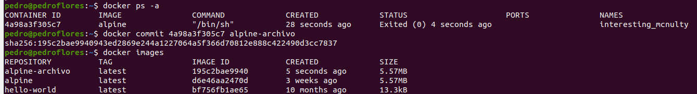

# 3. Crear a partir del contenedor anterior una imagen persistente con commit.

Para este ejercicio, vamos a usar por ejemplo el contenedor de `Alpine` . Lo que vamos a hacer es crear una archivo en el contenedor y luego hacer una nueva imagen que contenga dicho archivo. Primero creamos el archivo dentro del contenedor.

Ahora, vamos a crear la imagen

