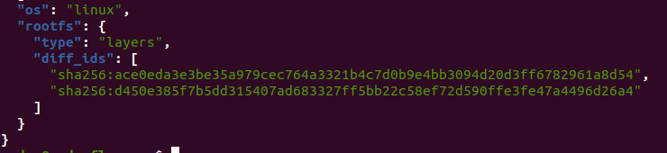

# 4. Examinar la estructura de capas que se forma al crear imágenes nuevas a partir de contenedores que se hayan estado ejecutando.

Para examinar las capas de la imagen anterior ejecutamos el comando 

```
sudo jq '.' /var/lib/docker/image/overlay2/imagedb/content/sha256/195c2bae9940943ed2869e244a1227064a5f366d70812e888c422490d3cc7837

```

Si vamos al elemento `diff_ids` nos muestra

