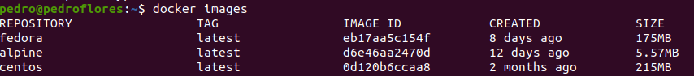

# 2. Tomar algún programa simple, “Hola mundo” impreso desde el intérprete de línea de órdenes, y comparar el tamaño de las imágenes de diferentes sistemas operativos base, Fedora, CentOS y Alpine, por ejemplo.

Desde la terminal, hemos usado los siguientes comandos:

```
$> docker pull alpine
$> docker pull centos:latest
$> docker pull fedora
```

Ahora, vemos el tamaño de las imágenes



Vemos que la que menos ocupa es `Alpine` seguida de `Fedora` y luego `CentOS`.