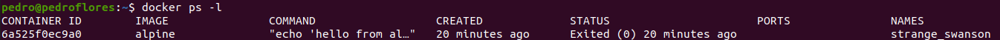
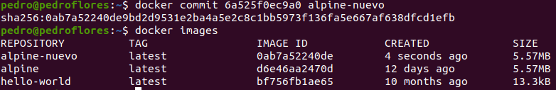

# 3. Crear a partir del contenedor anterior una imagen persistente con commit.

Para este ejercicio, vamos a usar por ejemplo el contenedor de `Alpine` en el que hemos hecho que muestre 'Hola mundo' por pantalla.

Creamos la nueva imagen a partir de dicho contenedor

