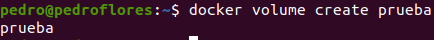
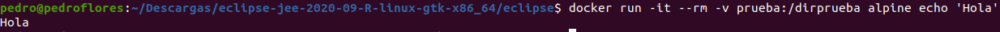

# 5. Crear un volumen y usarlo, por ejemplo, para escribir la salida de un programa determinado.

En primer lugar, creamos el volumen

Y ahora ejecutamos un ejemplo, indicando que se monte en el directorio `/dirprueba`.

