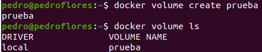
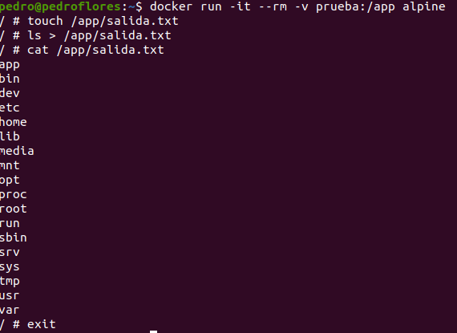
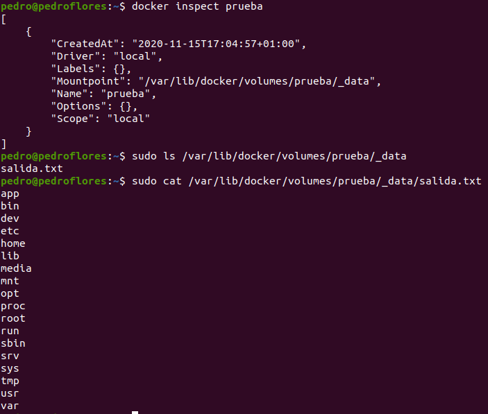

# 5. Crear un volumen y usarlo, por ejemplo, para escribir la salida de un programa determinado.

En primer lugar, creamos el volumen

Ahora, vamos a montar en `/app` del directorio de `Alpine` y escribir algo en ese directorio.

Veamos que efectivamente, se ha almacenado en el volumen.

