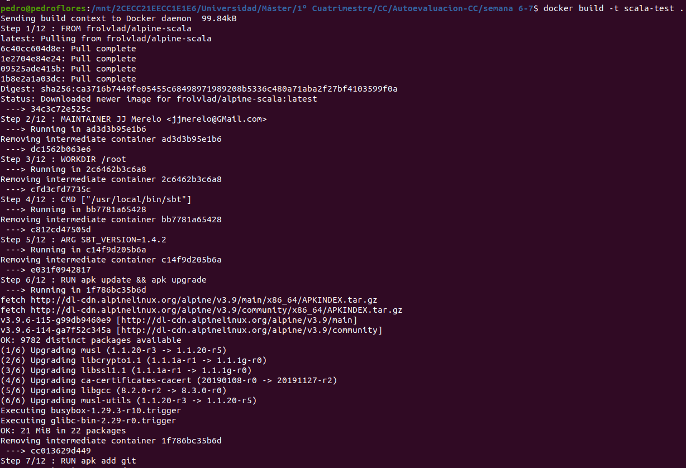
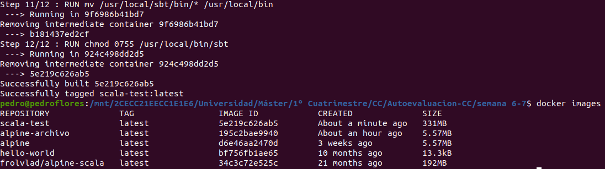
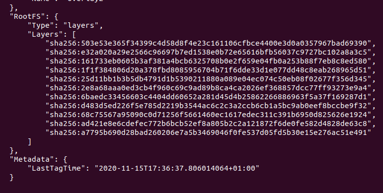
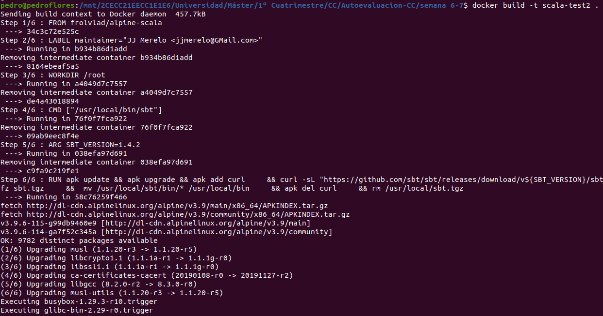
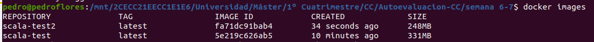
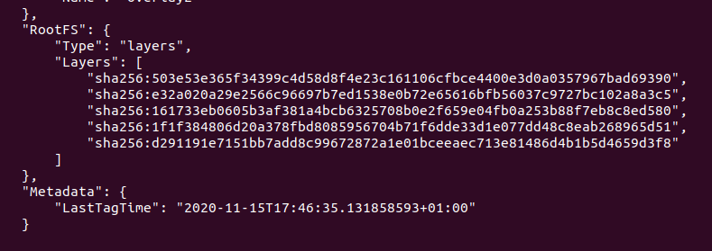

# 6. Reproducir los contenedores creados anteriormente usando un `Dockerfile`.

Se ha copiado en el `Dockerfile` el código proporcionado. Ahora creamos la imagen mediante `build` y vemos que efectivamente se ha creado.

Ahora mediante la orden `inspect`, vemos que efectivamente esta imagen contiene muchas capas.

Cambiamos el contenido del [Dockerfile](./Dockerfile) por el nuevo. Veamos el resultado.

Vemos que efectivamente ha reducido su tamaño. Comprobemos las capas.

