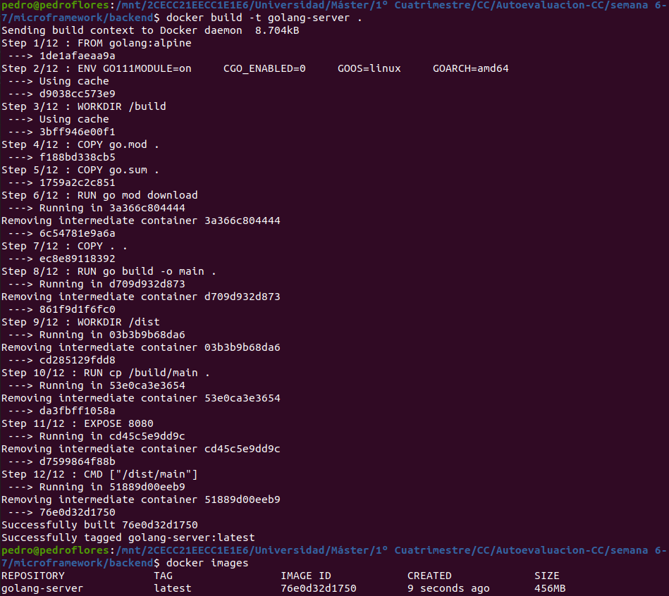
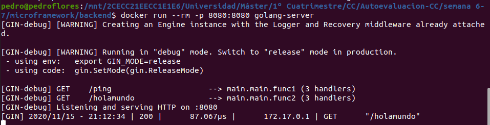
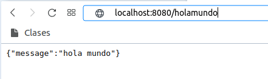

# 7. Usar un miniframework REST para crear un servicio web y introducirlo en un contenedor, y componerlo con un cliente REST que sea el que finalmente se ejecuta y sirve como "frontend".

Para el ejercicio vamos a usar [este tutorial](https://levelup.gitconnected.com/complete-guide-to-create-docker-container-for-your-golang-application-80f3fb59a15e). En él aparece una aplicación sencilla REST sencilla escrita en `Go` además de cómo construir el `Dockerfile`. En este caso, parte de una imagen de `Alpine` en la que ya viene instalada en lenguaje y configura por ejemplo el uso de `Go modules ` para las dependencias. Los archivos para este servicio (incluyendo `Dockerfile` y archivos de código) se encuentran en la carpeta [backend](./microframework/backend). 

Vamos a construirlo y ver que funciona:

NOTA: lo completamos más adelante en un ejercicio correspondiente a la semana 14-16