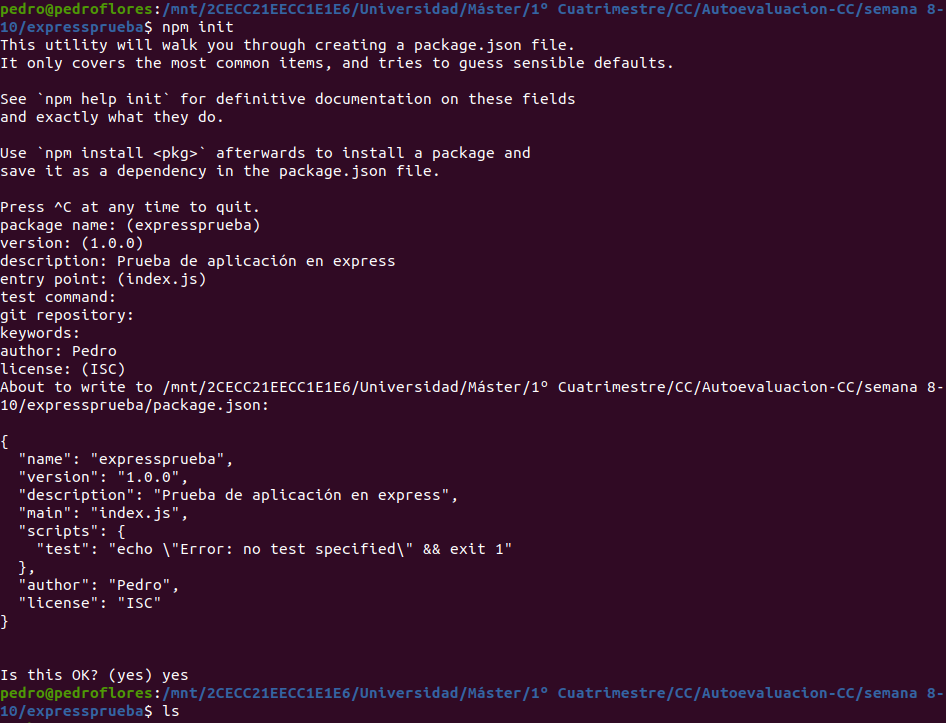
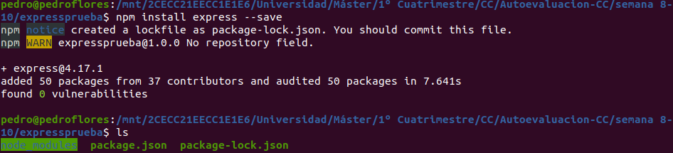
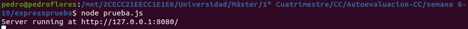

# 2.  Realizar una aplicación básica que use express para devolver alguna estructura de datos del modelo que se viene usando en el curso.

Primero, creamos el directorio `expressprueba` y dentro de él ejecutamos el comando `npm init` para crear el `package.json`:

A continuación, instalamos `express`:

Ahora, adaptamos el código del archivo [prueba.js](./expressprueba/prueba.js) para devolver una estructura del proyecto, en concreto, una Reseña

Referencias:
* [Ejemplo Hello world](https://expressjs.com/es/starter/hello-world.html).