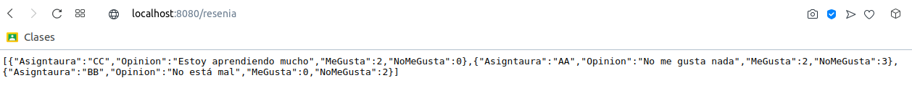
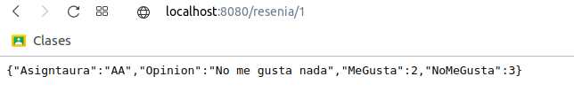
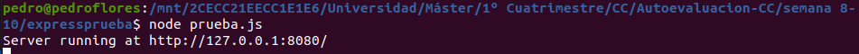

# 3 Programar un microservicio en express (o el lenguaje y marco elegido) que incluya variables como en el caso anterior.

En este caso, vamos a modificar el ejemplo del ejercicio 2 del del archivo [prueba.js](./expressprueba/prueba.js) y vamos a incluir un array con varias reseñas y vamos a poder a acceder a cada una de las mimas mediante una variable. El código está en el archivo [prueba_var.js](./expressprueba/prueba_var.js). Vemos un ejemplo del mismo:

