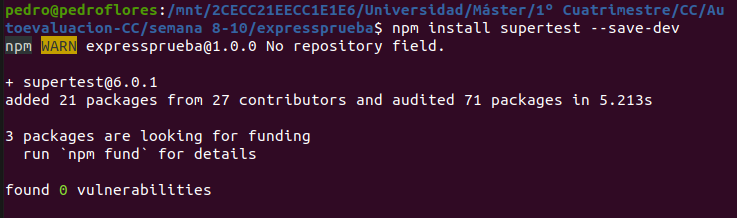
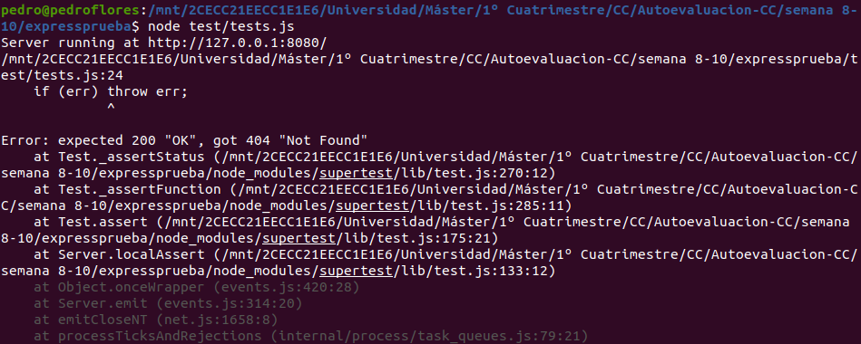

# 4 Crear pruebas para las diferentes rutas de la aplicación.

Primero lo que hacemos es instalar `Supertest` 



Ahora, escribimos un par de tests para la aplicación [prueba.js](./expressprueba/prueba.js) que se encuentran en el archivo [tests.js](./expressprueba/test/tests.js). Si ahora ejecutamos 

```shell
nodejs tests/test.js
```
no obtenemos ninguna alerta. Sin embargo, si ponemos una dirección que no hemos definido obtenemos un error como el siguiente.



Referencias
 * [Supertest](https://www.npmjs.com/package/supertest)