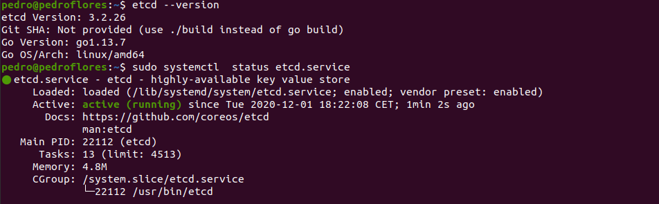
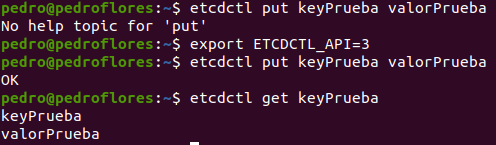
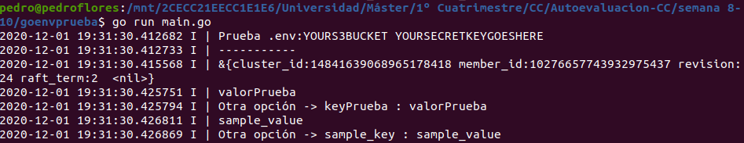

# 1. Instalar etcd3, averiguar qué bibliotecas funcionan bien con el lenguaje que estemos escribiendo el proyecto (u otro lenguaje), y hacer un pequeño ejemplo de almacenamiento y recuperación de una clave; hacer el almacenamiento desde la línea de órdenes (con etcdctl) y la recuperación desde el mini-programa que hagáis.

El lenguaje con el que estamos haciendo el proyecto es `Go`. Los enlaces consultados para realizar el ejercicio han sido:

* [Instalar etcd](https://tecrobust.com/how-to-install-etcd-on-ubuntu-20-04-lts/)
* [Interacting with etcd](https://etcd.io/docs/v3.4.0/dev-guide/interacting_v3/)
* [etcd in Go](https://github.com/etcd-io/etcd/tree/master/client/v3)
* [godotenv](https://github.com/joho/godotenv)
* [Solución error](https://github.com/etcd-io/etcd/issues/12484): no permite usar la última versión así que hay que hacer manualmente `go get ...`

Tras ejecutar la instalación, vemos la versión y que está activo

Ahora, vamos a crear la clave desde la línea de órdenes (es necesario hacer [export ETCDCTL_API=3](https://github.com/etcd-io/etcd/issues/6897) para que funcione)

Pasamos a ejecutar el programa que está en la carpeta [goenvprueba/main.go](./goenvprueba/main.go). En este programa hacemos una prueba de `dotenv` y de `etcd` tanto para escribir una variable como para leer. El resultado es el siguiente

