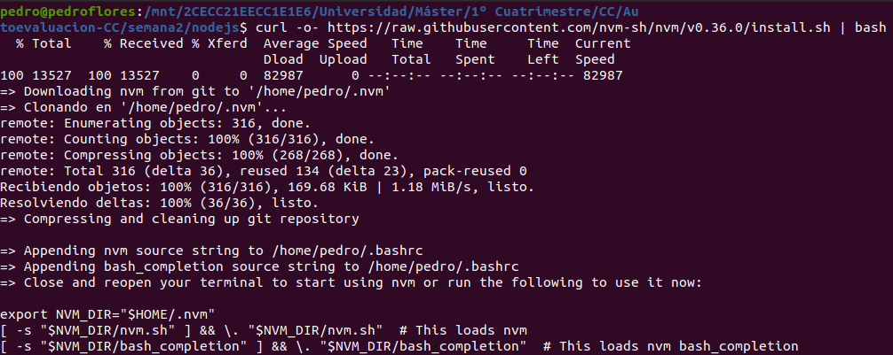
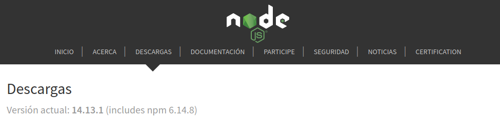
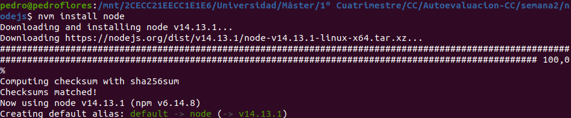
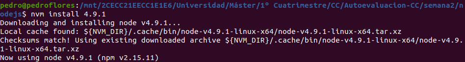
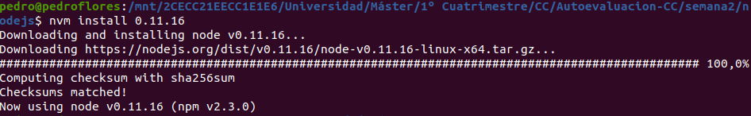
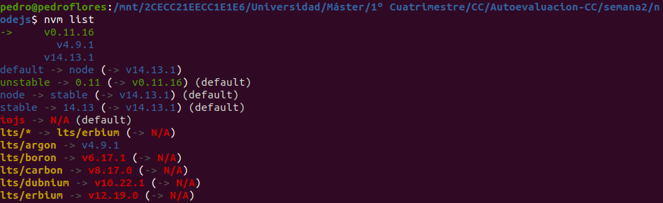

# Instalar alguno de los entornos virtuales de node.js (o de cualquier otro lenguaje con el que se esté familiarizado) y, con ellos, instalar la última versión existente, la versión minor más actual de la 4.x y lo mismo para la 0.11 o alguna impar (de desarrollo).

Se va a instalar el entorno virtual `nvm` de `node.js`. Para ello, se ha seguido [esta guía](https://github.com/nvm-sh/nvm#installing-and-updating)

1. Instalar el *script*.

1. Instalamos la última versión que es la 14.13.1 (última versión a día 14/10/2020). 

Para ello, usamos el alias `node`.

3. Instalamos la versión minos más actual de 4.x que es la 4.9.1 ([versiones de node.js](https://nodejs.org/es/download/releases/)).
   
4. Lo mismos para 0.11.
   
5. Listamos todas las instaladas.
   
   